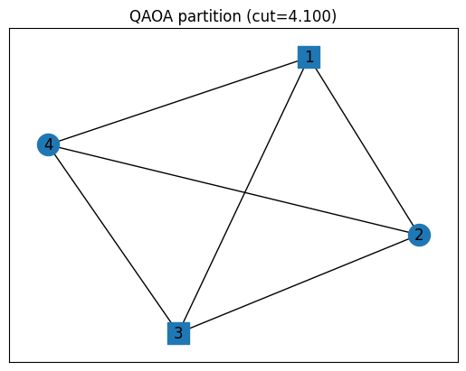
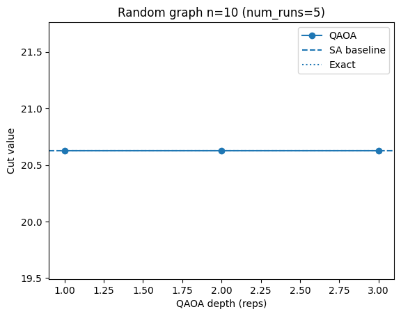

# Max-Cut with MQT-Quantum Auto Optimizer (QAOA vs Classical Baseline)

This project solves a classic “split the network into two lively teams” puzzle called **Max-Cut**. Think dots connected by lines: we want two groups so as many lines as possible go **across** the groups. I compared a quantum-style method with a strong classical method on small test graphs. Both found the best answers. Everything’s wrapped with scripts, plots, and exact checks so anyone can rerun the results.

I formulated **Max-Cut** as a **QUBO** and solve it with the **MQT Quantum Auto Optimizer (MQT-QAO)** framework—comparing **QAOA** to a **Simulated Annealing** baseline. I ran parameter sweeps (depths/seeds), verified optima by brute force on small graphs, and exported reproducible artifacts (CSVs + figures). On these instances, both approaches reached the known optimum.

---

## Repo structure

```text
src/         # scripts (QAOA, SA, sweeps, summary)
results/     # CSVs + summary.md (generated)
figures/     # saved plots (generated)
data/graphs  # optional graph files
venv/        # local virtual environment (not committed)
```

---

## Getting Started (Windows PowerShell example)

```powershell
# (create and activate venv first)
# python -m venv venv
# .\venv\Scripts\Activate.ps1
# pip install -U pip

# required packages (versions chosen for compatibility)
pip install -r requirements.txt

# tiny demo with exact check + figure
python src/maxcut_qao.py

# parameter sweep on the toy graph
python src/sweep_qaoa.py

# random graphs (n ≤ 10 keeps exact check fast)
python src/sweep_random_maxcut.py --n 8  --p_edge 0.6 --seed 42 --reps 1 2 3 --num_runs 5
python src/sweep_random_maxcut.py --n 10 --p_edge 0.6 --seed 7  --reps 1 2 3 --num_runs 5

# combine CSVs into a Markdown table
python src/summarize_results.py
```

---

## Results

I evaluated **QAOA** vs a classical **Simulated Annealing (SA)** baseline on small Max-Cut instances.
QAOA depth `reps ∈ {1,2,3}`; each with `num_runs=5`.

### Key takeaways

* QAOA matched the exact optimum on all tested small graphs.
* Deeper QAOA increased runtime, with limited gains on these easy instances.
* Reproducible scripts, CSVs in `results/`, and figures in `figures/`.

### Summary table

(Generated by `src/summarize_results.py`)

#### Experiment summary

| file                              | reps | num\_runs | qaoa\_cut | sa\_cut | exact\_cut | note  | qaoa\_time\_s |
| --------------------------------- | ---: | --------: | --------: | ------: | ---------: | :---- | ------------: |
| qaoa\_sweep.csv                   |    1 |         5 |     4.100 |   4.100 |      4.100 | ✅=opt |          2.93 |
| qaoa\_sweep.csv                   |    2 |         5 |     4.100 |   4.100 |      4.100 | ✅=opt |          8.00 |
| qaoa\_sweep.csv                   |    3 |         5 |     4.100 |   4.100 |      4.100 | ✅=opt |         31.58 |
| qaoa\_sweep\_n10\_p0.6\_seed7.csv |    1 |         5 |    20.626 |  20.626 |     20.626 | ✅=opt |         19.55 |
| qaoa\_sweep\_n10\_p0.6\_seed7.csv |    2 |         5 |    20.626 |  20.626 |     20.626 | ✅=opt |         54.97 |
| qaoa\_sweep\_n10\_p0.6\_seed7.csv |    3 |         5 |    20.626 |  20.626 |     20.626 | ✅=opt |        238.45 |
| qaoa\_sweep\_n8\_p0.6\_seed42.csv |    1 |         5 |    13.514 |  13.514 |     13.514 | ✅=opt |          9.65 |
| qaoa\_sweep\_n8\_p0.6\_seed42.csv |    2 |         5 |    13.514 |  13.514 |     13.514 | ✅=opt |         24.32 |
| qaoa\_sweep\_n8\_p0.6\_seed42.csv |    3 |         5 |    13.514 |  13.514 |     13.514 | ✅=opt |         71.22 |

### Example figures





---

## Acknowledgements & References

This work uses the **MQT Quantum Auto Optimizer (MQT-QAO)**, part of the **Munich Quantum Toolkit** developed by the **Chair for Design Automation** at the Technical University of Munich, in collaboration with the **VLSI Lab of Politecnico di Torino**.

```bibtex
@inproceedings{volpe2024towards,
  author        = {Deborah Volpe and Nils Quetschlich and Mariagrazia Graziano and Giovanna Turvani and Robert Wille},
  title         = {Towards an Automatic Framework for Solving Optimization Problems with Quantum Computers},
  booktitle     = {IEEE International Conference on Quantum Software (QSW)},
  year          = {2024},
  eprint        = {2406.12840},
  archivePrefix = {arXiv},
  primaryClass  = {quant-ph}
}

@inproceedings{volpe2024predictive,
  author        = {Deborah Volpe and Nils Quetschlich and Mariagrazia Graziano and Giovanna Turvani and Robert Wille},
  title         = {A Predictive Approach for Selecting the Best Quantum Solver for an Optimization Problem},
  booktitle     = {IEEE International Conference on Quantum Computing and Engineering (QCE)},
  year          = {2024},
  eprint        = {2408.03613},
  archivePrefix = {arXiv},
  primaryClass  = {quant-ph}
}
```
